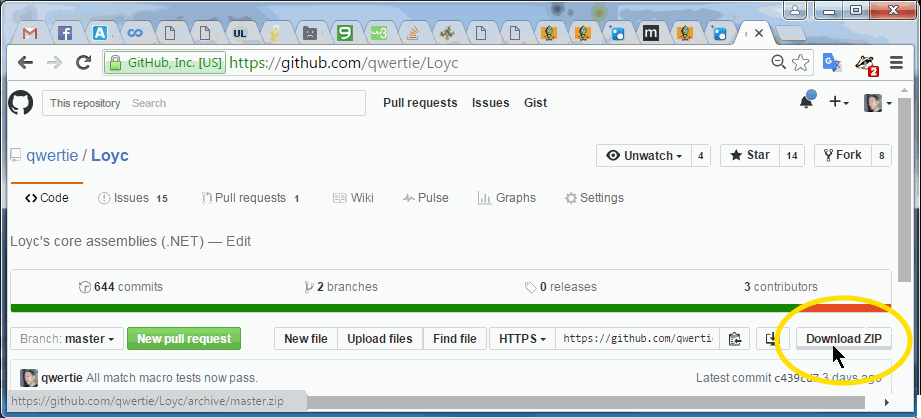
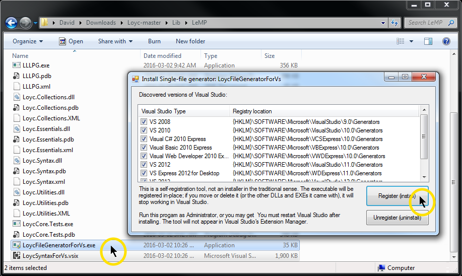
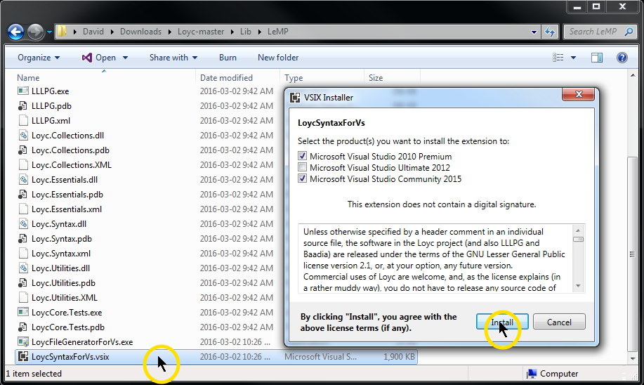
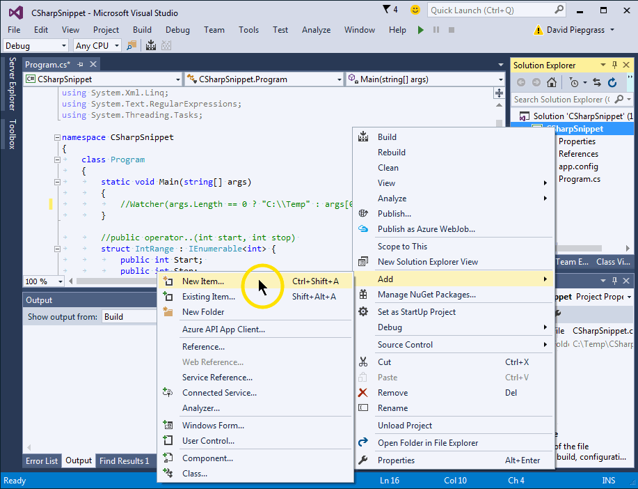
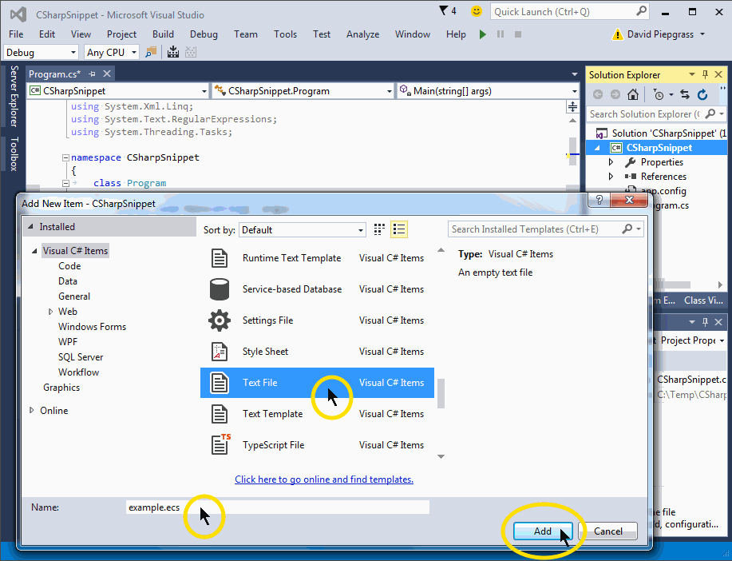
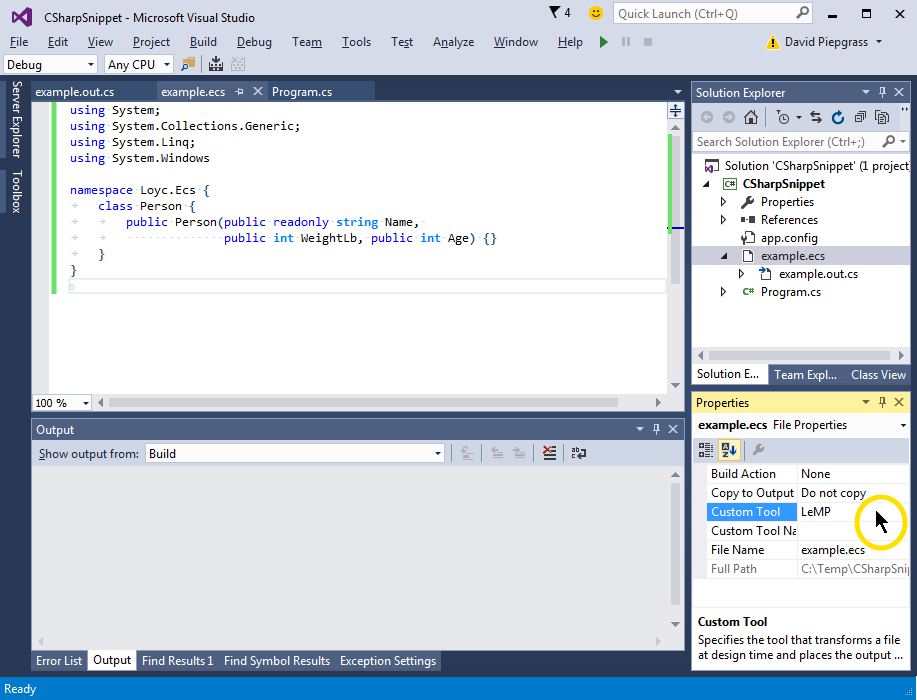

_March 2, 2016 (edited March 5)_

Introduction
------------

Today I planned to write an article about the new pattern-matching and "algebraic data type" features I added to C# via [LeMP](https://github.com/qwertie/Loyc/wiki/LeMP), but then I saw the new [WuffProjects.CodeGeneration](http://www.codeproject.com/Articles/892114/WuffProjects-CodeGeneration) library and thought "wait a minute, LeMP has made that easy for a year now!" In fact, LeMP can do some pretty neat stuff, as you'll see!

LeMP is a macro processor for a superset of C# called "Enhanced C#". If you've ever used [sweet.js](http://sweetjs.org/), LeMP is basically the same thing for C#, just not as polished. Also, whereas sweet.js seems focused on letting you create your own macros, LeMP comes with many useful macros right-out-of-the-box, but creating new ones isn't as easy (yet).

So here's the scenario: you want to write a program that generates C# source code, and either runs it or analyzes it somehow. How should you do it?

In fact, this article also shows how to _parse_ and analyze C# source code, but I'll focus first on code generation. This article also contains links to some fascinating stuff, so try to read to the end before you click off to somewhere else... this article gets more interesting (IMO) as you geet farther into it! 

Background: The Old Ways
------------------------

First, let's touch on a couple of alternatives:

- Obviously, you can generate C# code as a string and simply write it to a file. That's okay for simple tasks, but it can be challenging to ensure that the syntax and spacing is correct. Therefore, many people use [CodeDom](https://msdn.microsoft.com/en-us/library/y2k85ax6(v=vs.110).aspx), but that's a "lowest common denominator" technology; the constructs supported by CodeDom are limited. Finally there's [Roslyn](https://github.com/dotnet/roslyn), which includes the recently-open-sourced official C# compiler engine. Compared to LeMP it's downright clunky to use, but it does offer semantic analysis and 100% perfect reliability.
- If you'd like to generate code inside Visual Studio, the most well-known approach is to use T4 templates. However, it may be better to use LeMP instead, because (1) the output looks better (no ugly indentation problems), (2) your input file is much more elegant, (3) LeMP has lots of built-in features to enhance C#, and (4) your input file gets syntax highlighting thanks to a free Visual Studio extension. Let me know in the comments what you'd like to accomplish with LeMP; I might be able to help!

Now, a couple of years ago I wrote the [LL(k) parser generator](http://www.codeproject.com/Articles/664785/A-New-Parser-Generator-for-Csharp), which needs a robust way to generate C# code. For this it uses [Loyc trees](https://github.com/qwertie/LoycCore/wiki/Loyc-trees) printed by the Enhanced C# printing engine in Loyc.Ecs.dll, all of which is part of the [Loyc repo on GitHub](https://github.com/qwertie/Loyc).

In layman's terms, you can use somewhat scary code like this to generate C# (**without** any LeMP goodness):

~~~csharp
public static void Main(string[] args)
{
   File.WriteAllText("helloWorld.cs", HelloWorldProgram("Hello, World!"));
}
static string HelloWorldProgram(string whatToPrint)
{
    var F = new LNodeFactory(EmptySourceFile.Unknown);
    var code = LNode.List(
        F.Call(CodeSymbols.Import, F.Id("System")),
        F.Call(CodeSymbols.Import, F.Dot(F.Id("System"), F.Id("Collections"), F.Id("Generic"))),
        F.Call(CodeSymbols.Namespace, F.Id("Namespaze"), F.Missing, F.Braces(
            F.Call(CodeSymbols.Class, F.Id("Klass"), F.List(), F.Braces(
                F.Fn(F.Void, F.Id("Main"), F.List(), F.Braces(
                    F.Call(F.Dot(F.Id("Console"), F.Id("WriteLine")), F.Literal(whatToPrint))
                ))
            ))
        )));
    return EcsLanguageService.WithPlainCSharpPrinter.Print(code);
}
~~~

Then `HelloWorldProgram("Hello, World!")` returns

~~~csharp
using System;
using System.Collections.Generic;
namespace Namespaze
{
  class Klass
  {
    void Main()
    {
      Console.WriteLine("Hello, world!");
    }
  }
}
~~~

It's a little easier if you ask the parser to do some of the work, and then do a find-and-replace...

~~~csharp
static string HelloWorldProgram(string whatToPrint)
{
   var F = new LNodeFactory(EmptySourceFile.Unknown);
   IEnumerable<LNode> code = EcsLanguageService.Value.Parse(@"
      using System;
      using System.Collections.Generic;
      namespace Namespaze {
         class Klass {
            void Main() {
               Console.WriteLine(PLACEHOLDER);
            }
         }
      }",
      MessageSink.Console, ParsingService.Stmts); 
   
   // Now substitute code requested by caller
   code = code.Select((LNode stmt) => 
      stmt.ReplaceRecursive(expr => {
         if (expr.IsIdNamed("PLACEHOLDER"))
            return F.Literal(whatToPrint);
         return null;
      }));
   
   return EcsLanguageService.WithPlainCSharpPrinter.Print(code);
}
~~~

But this isn't really what you want, since syntax errors are not detected at compile-time, and you're wasting runtime CPU cycles on _parsing_ code instead of _generating_ it.

Introducing LeMP
----------------

LeMP lets you do code generation with a "literal" representation of the code (in comp-sci jargon, it makes C# pretend to be [homoiconic](https://en.wikipedia.org/wiki/Homoiconicity)). For example, suppose you want to generate a method called `Square()` that takes a parameter of a user-defined type `T` and squares it. You'll be able to write that as

~~~csharp
   static LNode GetSquareFunction(LNode T) {
      return quote {
         public static $T Square($T x) => x*x;
      };
   }
~~~

But first, you'll need to install the code generator in Visual Studio.

### Installing LeMP

First, download and extract the zip file, or clone the [Loyc respository](https://github.com/qwertie/Loyc) from GitHub, since I haven't yet figured out how to do that magic auto-installation via NuGet.

Next, browse to the `Lib\LeMP` folder and run `Lib\LeMP\LoycFileGeneratorForVs.exe` to install the LeMP and LLLPG Custom Tools (a.k.a. Single-File Generators). Make sure your version of Visual Studio is listed, and click Register (install).

**Note**: The custom tools run in-place; they are not copied anywhere else. Visual Studio versions 2008 through 2015 are supported.

To install syntax highlighting for `.ecs` and `.les` files, run `Lib\LeMP\LoycSyntaxForVs.vsix`. Visual Studio versions 2010 through 2015 are supported.

Finally, create a new C# project in Visual Studio (or open an existing one), and then create a new text file named `example.ecs`:

Finally, open the *Properties* panel and change the *Custom Tool* option to **_LeMP_**. An output file called `example.out.cs` should appear under `example.ecs`. To make sure it's all working fine, paste a little code in the new file, e.g.

~~~csharp
using System;
using System.Collections.Generic;
using System.Linq;
using System.Windows
namespace Loyc.Ecs {
   class Person {
      public Person(public readonly string Name, public int WeightLb, public int Age) {}
   }
}
~~~

**Warning**: Before installing a new version of LeMP or LLLPG, you must uninstall the old syntax highlighter _(Tools \| Extensions and Updates \| LoycSyntaxForVS \| Uninstall)_. A version mismatch between the two will cause the LeMP or LLLPG Custom Tool to stop working (typically with a `MissingMethodException` or a failure to load an assembly.)

As of this writing, the Loyc libraries have a version number of 1.5.*.

You can use basic features of LeMP already, but if you want write a code generator, you'll also have to add references to the DLLs you'll be using in your program (see below).

### Using LeMP to write a code generator

LeMP itself is a code generator, so what I'm doing now is showing you how to use a code generator in Visual Studio (LeMP) to generate another code generator that runs outside Visual Studio. (You could then, if you wanted, reprogram your code generator to run inside Visual Studio by reading my article about [Custom Tools](http://www.codeproject.com/Articles/686405/Writing-a-Single-File-Generator), or better yet, by writing a macro to be called by LeMP itself.)

This may sound complicated, but it's easy to do, at least after you've installed LeMP, made an `example.ecs` file in your project and assigned `LeMP` as the _Custom Tool_.

You'll need to add references to the following assemblies from your copy of LeMP:

- `Loyc.Essentials.dll`
- `Loyc.Collections.dll`
- `Loyc.Syntax.dll`
- `Loyc.Ecs.dll`

Put the following code in your `example.ecs` file:

~~~csharp
using System;
using System.Collections.Generic;
using System.Linq;
using System.Text;
using Loyc;
using Loyc.Collections;
using Loyc.Syntax;
using Loyc.Ecs;

namespace Loyc.Ecs {
   class Example {
      public static string HelloWorldProgram(string whatToPrint) {
         LNode code = quote {
            using System;
            using System.Collections.Generic;
            namespace Namespaze {
               class Klass {
                  void Main() {
                     Console.WriteLine($(LNode.Literal(whatToPrint)));
                  }
               }
            }
         };
         return EcsLanguageService.WithPlainCSharpPrinter.Print(code.Args);
      }
   }
}
~~~

Then locate your `Main` method and add a call to `Console.WriteLine(Example.HelloWorldProgram("Howdy folks!"))`. Run and make sure it works.

The trick here, and the reason we're using LeMP instead of plain C#, is that LeMP includes a neat trick called "quote", which allows us to generate syntax trees inside our C# code. In this case we've quoted an entire C# source file:

~~~csharp
   LNode code = quote {
      using System;
      using System.Collections.Generic;
      namespace Namespaze {
         class Klass {
            void Main() {
               Console.WriteLine($(LNode.Literal(whatToPrint)));
            }
         }
      }
   };
~~~

`LNode` (short for [Loyc tree node](https://github.com/qwertie/LoycCore/wiki/Loyc-trees)) is a flexible "generic" syntax tree which could, theoretically, represent code in any programming language, but happens (at the moment) to represent C# code. An `LNode` is immutable (read-only).

`quote` is a macro — a function that transforms one syntax tree into another. It generates code to construct the syntax tree you asked for; for example, if you write 

~~~csharp
    LNode call = quote(func(12345));
~~~

You'll see code in your output file (example.out.cs) to create a syntax tree representing a call to `func` with `12345` as its argument list:

~~~csharp
   LNode call = LNode.Call((Symbol) "func", LNode.List(LNode.Literal(12345)));
~~~

`quote` allows you to insert subtrees into your tree. For example, if you write

~~~csharp
    LNode assignment = quote(x = $call);
~~~

`quote` assumes that `$call` refers to a variable of type `LNode` called `call`, so it inserts `call` into the output, like this:

~~~csharp
   LNode assignment = LNode.Call(CodeSymbols.Assign, 
      LNode.List(LNode.Id((Symbol) "x"), call)).SetStyle(NodeStyle.Operator);
~~~

`quote` accepts either an `(expression in parentheses)` or a `{ statement in braces; }`. When using braces, make sure to add a semicolon at the end of the statement! If you'd like to create a syntax tree that itself represents a braced block, you'll need to use double braces as in `quote {{ stuff; }}`.

Because the output from `quote` refers to data types such as `Symbol`, `CodeSymbols`, and `LNode`, you may need to add references to the following namespaces when using this macro:

~~~csharp
using Loyc;        // For Symbol
using Loyc.Syntax; // For LNode, CodeSymbols
~~~

Macros themselves cannot make non-local changes, so `quote` itself cannot add these `using` directives on your behalf.

Other useful namespaces include

~~~csharp
using Loyc.Collections; // For VList<LNode>, a list of LNodes (value type)
using Loyc.Ecs;         // For EcsLanguageService (Enhanced C# parser/printer)
~~~

Generating code in a loop
-------------------------

If you're generating code, a common task is generating a sequence of similar statements, methods, or data types.

The normal data type for lists of `LNode` is called `VList<LNode>`. Note that [VLists](http://www.codeproject.com/Articles/26171/VList-data-structures-in-C) are value types, so they can only be empty, never null.

As an example, here's one way to generate a sequence of `using` statements from a sequence of namespaces:

~~~csharp
VList<LNode> namespaces = quote(System, System.Text, System.Linq).Args;
VList<LNode> usings = LNode.List(namespaces.Select(ns => quote { using $ns; }));
~~~

**Note**: `quote` always produces a single `LNode`. If you quote multiple things, the outer node will be a call to the special identifier `#splice` — in this case `#splice(System, System.Text, System.Linq)`. By writing `quote(...).Args`, we are extracting the three arguments to the `#splice` pseudo-function.

Alternately, you could use a loop:

~~~csharp
VList<LNode> namespaces = quote(System, System.Text, System.Linq).Args;
VList<LNode> usings = LNode.List();
foreach (var ns in namespaces)
   usings.Add(quote { using $ns; });
~~~

If you have a `VList<LNode>` or `IEnumerable<LNode>`, you can "splice" it into an argument list by using `$(..list)` inside of a `quote`. For example, given a list of method arguments, we might like to splice them into a method declaration:

~~~csharp
VList<LNode> args = quote{ string second; object third; }.Args;
LNode function = quote {
   void function(int first, $(..args), long fourth) {}
};
Console.WriteLine(EcsLanguageService.Value.Print(function));
~~~

The output is

~~~csharp
void function(int first, string second, object third, long fourth)
{
}
~~~

As you can see, the `$(..args)` expression causes the nodes in `args` to be expanded and treated as part of the function's argument list.

A peculiar thing here is that `string second; object third;` are separated by _semicolons_, even though arguments in a method's argument list are separated by _commas_. In fact, if you try to separate these variables by commas, you'll get a syntax error. So what's really going on here?

There are two parts to the answer.

1. First, the syntax: why is are there semicolons? The Enhanced C# parser used by LeMP has no idea that the variables `second` and `third` will be used later in a function argument list. All it sees are two ordinary variable declarations inside braces. Because of the braces, a semicolon is required at the end of each statement. **Note**: If you change the code to `quote(string second, object third)`, you'll actually get a _syntax error_ because in that case, the parser treats `quote()` as an ordinary function call, so its arguments are not allowed to be (unassigned) variable declarations.
2. Second: why does this work? The fact that you can insert what appear to be _statements_ into the middle of an _argument list_ works because a syntax tree that represents a variable declaration like "`int x;`" is identical to the syntax tree that represents a method argument like "`int x`". This is a property of the mapping from "Enhanced C#" (the syntax accepted by LeMP) to Loyc trees, and this mapping tends to be designed in such a way that you can transplant syntax trees from one place to another and it "just works" the way you want it to.

I won't distract you with too much depth on this topic; if you want to know more, please ask.

Converting code to text and compiling it
----------------------------------------

To convert an `LNode` to text, you can use `EcsLanguageService.WithPlainCSharpPrinter.Print(lnode)` as shown earlier. Using `EcsLanguageService.WithPlainCSharpPrinter` instead of `EcsLanguageService.Value` tells the printer to avoid using syntax that is not part of "plain-old" C#, if possible.

You can also simply call `LNode.ToString()` as in

~~~csharp
   Console.WriteLine("{0}", quote { class Foo {} });
   /*   Output:
         #class(Foo, @``, {});
   */
~~~

But this doesn't work the way you want, because the default output language is [LES](https://github.com/qwertie/LoycCore/wiki/Loyc-Expression-Syntax), not C#. You can, however, change the current output language to C# by `using (LNode.PushPrinter(...))`:

~~~csharp
   using (LNode.PushPrinter(EcsLanguageService.WithPlainCSharpPrinter.Printer))
      Console.WriteLine("{0}", quote { class Foo {} });
    /*      Output:
            class Foo
            {
            }
   */
~~~

That's better! Having converted your code to a string, you can run it using the `CSharpCodeProvider` in System.dll. Here's a demonstration:

~~~csharp
static void CompileAndRun()
{
   VList<LNode> code = quote {
      using System;
      namespace Example {
         public class Code {
            public static double Square(double x) { return x*x; }
         }
      }
   }.Args;
   
   // Compile the code to an assembly in your "Temp" directory
   string[] codeStrings = {EcsLanguageService.Value.Print(code)};
   Assembly asm = CompileToAssembly(codeStrings, 
      new[] { "System.dll" }, MessageSink.Console);

   // Use reflection to find our compiled method
   var module = asm.GetModules()[0];
   do {
      if (module != null) {
         Type mt = module.GetType("Example.Code");
         if (mt != null) {
            MethodInfo methInfo = mt.GetMethod("Square");
            if (methInfo != null) {
               double n = 9.0;
               Console.WriteLine("The Square of {0} is {1}", n, 
                  methInfo.Invoke(null, new object[] { n }));
               break;
            }
         }
      }
      Console.WriteLine("Failed to locate method");
   } while (false);
}
 
static Assembly CompileToAssembly(string[] sourceFiles, string[] references = null, IMessageSink sink = null)
{
   references = references ?? new[] { "System.dll" };
   sink = sink ?? MessageSink.Current;
   
   CompilerParameters CompilerParams = new CompilerParameters();
   CompilerParams.GenerateInMemory = true;
   CompilerParams.TreatWarningsAsErrors = false;
   CompilerParams.GenerateExecutable = false;
   CompilerParams.CompilerOptions = "/optimize";
   CompilerParams.ReferencedAssemblies.AddRange(references);
   
   CSharpCodeProvider provider = new CSharpCodeProvider();
   CompilerResults compile = provider.CompileAssemblyFromSource(CompilerParams, sourceFiles);

   StringBuilder msgs = new StringBuilder("Compiler errors:\n");
   foreach (CompilerError msg in compile.Errors) {
      LogMessage lmsg = new LogMessage(msg.IsWarning ? Severity.Warning : Severity.Error, 
         new LineAndPos(msg.Line, msg.Column), "{0}: {1}", msg.ErrorNumber, msg.ErrorText);
      lmsg.WriteTo(MessageSink.Current);
      msgs.Append(lmsg.ToString() + "\n");
   }
   if (compile.Errors.HasErrors)
      throw new FormatException(msgs.ToString());

   return compile.CompiledAssembly;
}
~~~

It's that easy, although error handling can be quite a pain if the source code doesn't exist in a file anywhere, since the locations mentioned in the error messages don't tell you much.

Analyzing and manipulating syntax trees
---------------------------------------

What else can you do with a syntax tree?

### Writing it to a file ###

That's too easy:

~~~csharp
   VList<LNode> code = quote { 
      using System;
      class HelloWorld {
         public static void Main(string[] args) {
            Console.WriteLine("I'm not talking to you.");
         }
      }
   }.Args;
   string text = EcsLanguageService.WithPlainCSharpPrinter.Print(code, 
                            MessageSink.Console, ParsingService.File);
   File.WriteAllText("HelloWorld.cs", text);
~~~

### Finding and replacing ###

Given an `LNode` you can use `ReplaceRecursive` to find something, and optionally change it. For example, the following code finds every literal `true` in a code block and changes it to `!false`

~~~csharp
   node = node.ReplaceRecursive(expr => {
      // you could call expr.IsLiteral to find out if something is a literal,
      // but there's no need to do that if you're just looking for a Value.
      if (true.Equals(expr.Value))
         return quote(!false);
      
      return null; // make no change here
   }));
~~~

Remember that `LNode` is immutable, so this doesn't change the existing syntax tree, it creates a new one with some part(s) changed. That's why we write `node = node.ReplaceRecursive(...)`.

If you simply want to search for "everything that matches a certain pattern" and not change the syntax tree, you should still use the same `ReplaceRecursive` function, but always return `null` from it. If you want to avoid examining children of a particular node, simply return the same node you were given, which prevents children from being scanned without creating a new syntax tree:

~~~csharp
   node = node.ReplaceRecursive(expr => {
      matchCode (expr) {
         case { $type $method($(.._)) { $(.._); } }: // any normal method
			Console.WriteLine("Method '{0}' returns '{1}'", method, type);
            return expr; // prevent children from being scanned
      }
	  return null;
   });
~~~

### Pattern matching using matchCode ###

The `matchCode` macro provides pattern matching for a single `LNode`. You can use `$` to create variables that "capture" part of the syntax tree, or use `$_` for parts you don't care about. For example,

~~~csharp
static Symbol GetLoopType(LNode code)
{
   matchCode(code) {
      case { while($_) $_; }:       return CodeSymbols.While;
      case { for($_; $_; $_) $_; }: return CodeSymbols.For;
      case { do $_; while($_); }:   return CodeSymbols.Do;
      default: return null;
   }
}
~~~

#### What's a Symbol? ####

A `Symbol` is a kind of singleton string. Many programming languages, including Ruby and Ecmascript 6, have a "symbol" concept, but since .NET doesn't have a standard Symbol type, the Loyc libraries have their own. A `WeakValueDicionary` is used to store "global" Symbols; when you do `(Symbol) "mySymbol"` you are looking up an existing global symbol or creating a new one if it doesn't exist yet.

The main advantage of `Symbol` over `string` is that, since `Symbol`s are singletons, two `Symbol`s never need to be compared for equality like strings do, which improves their performance. If two `Symbol` references are equal then the symbols are equal, otherwise they are not equal; there is no need to compare the `Symbol.Name` inside the two symbols, and in fact no `operator==` is defined for `Symbol`. I [introduced `Symbol` in an old CodeProject article](http://www.codeproject.com/Articles/34753/Symbols-as-extensible-enums).

### Pattern-matching example #2: extract class name ###

Here's a method that finds the name of a class, struct, or enum type:

~~~csharp
static LNode GetName(LNode type)
{
   matchCode(type) {
      case { class  $name : $(.._) { $(.._); }  },
           { struct $name : $(.._) { $(.._); }  },
           { enum   $name : $(.._) { $(.._); }  }:
         return name;
      default:
         return null;
   }
}
~~~

The capture `$(.._)` contains the expression `.._`, which consists of two parts:

1. `..` which means "match any number of nodes (arguments or statements)"
2. `_` which means "discard the matching code". If you don't discard the result, it has type `VList<LNode>`.

So this thing:

~~~csharp
    class  $name : $(.._) { $(.._); }
~~~

means "match a class definition with any number of base types, and any number of statements inside the braces".

This demo shows the `GetName` function in action:

~~~csharp
public static void Demo()
{
   using (LNode.PushPrinter(EcsLanguageService.WithPlainCSharpPrinter.Printer)) {
      Console.WriteLine(GetName(quote {
         public sealed class String : System.Object, IEnumerable<char> {}
      }));
      Console.WriteLine(GetName(quote {
         public enum BinaryDigits { Zero, One }
      }));
      Console.WriteLine(GetName(quote {
         public struct Point<T> { 
            public T X { get; set; } 
            public T Y { get; set; }
         }
      }));
   }
}
~~~

The output should be

~~~csharp
String;
BinaryDigits;
Point<T>;
~~~

By the way, if you're reading this and thinking "this LeMP thing has some pretty impressive capabilities... why haven't I heard of it before?" the answer is twofold:

1. this is the first article I've written about LeMP's new `matchCode` construct, and
2. I stopped working on LeMP for a couple of months because people showed very little interest in it. Currently if you Google "LeMP", my [original article about LeMP](http://www.codeproject.com/Articles/995264/Avoid-tedious-coding-with-LeMP-Part) doesn't show up in the top 10 search results, because nobody blogged about it so there ain't no links anywhere about it. If you like LeMP, please say so, share it with your friends, blog about it, make a YouTube video... something!

### Pattern-matching example 3: `[notify]` ###

You might want to look for a particular attribute on a particular construct. For example, let's say you want to find a 'notify' attribute on a property, which will help implement the standard [`INotifyPropertyChanged` interface](https://msdn.microsoft.com/library/ms229614(v=vs.100).aspx) by calling a user-defined `NotifyPropertyChanged` method. In other words, suppose we want to transform

~~~csharp
   public string CompanyName { get { return _companyName; } [notify] set; }
~~~

into this:

~~~csharp
   public string CompanyName {
      get { return _companyName; }
      set {
         if (_companyName != null ? !_companyName.Equals(value) : value != null) {
            _companyName = value;
            NotifyPropertyChanged("CompanyName");
         }
      }
   }
~~~

Here's a method that detects a property of the expected form and returns a new one, or the same property if unchanged:

~~~csharp
public static LNode MaybeTransformNotifyProperty(LNode input) {
   matchCode (input) {
      // Detect if this is a property with an empty setter, and grab its parts
      case {
         [$(..attrs)] $Type $Name { 
            [$(..getAttrs)] $getter; 
            [$(..setAttrs)] set;
         }
      }:
         // Look for `[notify]` in `setAttrs`
         LNode notify;
         setAttrs = setAttrs.WithoutNodeNamed((Symbol) "notify", out notify);
         if (notify == null)
            return input;
   
         // Support custom NotifyPropertyChanged method
         LNode notifyMethod = quote(NotifyPropertyChanged);
         matchCode(notify) {
            case $_($(ref notifyMethod)): // do nothing
         }
   
         // Discover the field name
         LNode fieldName;
         matchCode (getter) {
            case { get => $(ref fieldName); }, // C# 6 syntax?
                { get { $(.._); return $(ref fieldName); } }:
                // do nothing
            default:
               return input; // fail
         }
   
         // Choose difference check
         LNode changed;
         matchCode (Type) {
            case int, uint, byte, sbyte, short, ushort, 
                float, double, decimal, string:
               changed = quote(value != $fieldName);
            default:
               changed = quote($fieldName != null ? 
                  !$fieldName.Equals(value) : value != null);
         }
   
         // Extract property name and return output
         string propNameString = Name.Name.Name;
         return quote { 
            [$(..attrs)] public $Type $Name { 
               [$(..getAttrs)] $getter; 
               [$(..setAttrs)] set {
                  if ($changed) {
                     $fieldName = value;
                     $notifyMethod($(LNode.Literal(propNameString)));
                  }
               };
            };
         };
      default:
         return null;
   }
}
~~~

First, notice that the initial `matchCode (input)` looks for a property but doesn't directly match the `[notify]` attribute we're looking for. That's because of a limitation of `matchCode` in the current version: it is unable to do pattern matching on attributes, it can only grab the entire attribute list. Instead I call `setAttrs.WithoutAttrNamed` to search for an attribute with a particular name _and_ remove it from the attribute list, which we need to do anyway.

Second, what does this do?

~~~csharp
   LNode notifyMethod = quote(NotifyPropertyChanged);
   matchCode(notify) {
      case $_($(ref notifyMethod)): // do nothing
   }
~~~

You can control the name of the function that should be called if the property changed by writing `[notify(MethodName)]`. The default method is `NotifyPropertyChanged`. In `matchCode`, `$(ref X)` tells `matchCode` to assign the matching syntax tree to `X` rather than to create a new variable (which would be scoped to the inside of the `case` handler).

You do not need a `break` statement at the end of each `case`. In fact, as shown here, you don't need any code inside a case at all!

Next, look at the `matchCode (getter)` construct, which figures out the name of the backing field. Notice that `case` can accepts multiple patterns, each one optionally enclosed in braces; the braces indicate that you want to match a statement rather than an expression. In truth, Loyc trees do not distinguish between the concepts of "statement" and "expression"; what the braces really do is tell the parser to expect "statement syntax" rather than "expression syntax".

Choosing a difference-check is straightforward, but doesn't actually work right:

~~~csharp
   // Choose difference check
   LNode changed;
   matchCode (Type) {
      case int, uint, byte, sbyte, short, ushort, 
          float, double, decimal, string:
         changed = quote(value != $fieldName);
      default:
         changed = quote($fieldName != null ? 
            !$fieldName.Equals(value) : value != null);
   }
~~~

What we really want is to use the first check if the type has a meaningful `!=` operator, and use the second check if it's a reference type. However, LeMP doesn't have a semantic analysis engine, so it has no idea whether `Type` is a reference type or not. One way to solve this problem would be to somehow allow the programmer to signal what kind of equality check is desired, but I'll leave that as an exercise.

This line is a little funny:

~~~csharp
   string propNameString = Name.Name.Name;
~~~

The property name is an `LNode` called `Name`, and it has a property called `Name` which gets the identifier name _if_ it is a simple identifier. The name is a `Symbol`, not a string, but `Symbol` has a `Name` property that gets the string stored inside it.

This line is actually wrong, because it won't work properly for explicit interface implementations like this:

~~~csharp
   T IFunky.FunkyProp<T> { get { return _funkyProp; } [notify] set; }
~~~

In this case `Name` will hold the syntax tree for `IFunky.FunkyProp<T>`. If we want to extract the name `FunkyProp` from this, there is a method `EcsValidators.KeyNameComponentOf(Name)` for doing this. You can use this method as follows:

~~~csharp
   string propNameString = EcsValidators.KeyNameComponentOf(Name).Name.Name;
~~~

Finally, notice how we call the `notifyMethod`:

~~~csharp
   $notifyMethod($(LNode.Literal(propNameString)));
~~~

Remember that `quote` assumes its inputs have type `LNode` (or `VList<LNode>` if you use `$(..list)`), so I've used `$(LNode.Literal(propNameString))` to convert the string into an `LNode` by calling `LNode.Literal()`. 

#### Calling your method ####

Now that we have a method to transform a property, the final task is to _find_ the properties. Again, this can be done with `ReplaceRecursive`:

~~~csharp
   node = node.ReplaceRecursive(MaybeTransformNotifyProperty);
~~~

#### Exercises for you ####

**First exercise**: modify the code so that

    notify public string CompanyName => _companyName;

produces the same output as the original statement,

    public string CompanyName { get { return _companyName; } [notify] set; }

This time I've used `notify` instead of `[notify]`; this makes it a "custom word attribute", similar to `partial class` or `yield return`: `partial` and `yield` are not keywords, but the C# compiler treats them as if they were. Similarly, Enhanced C# treats `notify` as if it were a keyword attribute like `public` or `virtual`. The following two statements are equivalent:

~~~csharp
notify public      string CompanyName => _companyName;
[#notify, #public] string CompanyName => _companyName;
~~~

That is:

- Keyword attributes like `public` and `sealed` are treated like normal attributes, just with `#` prepended on the front. **Note**: `#` is not considered to be an operator and it does not necessarily mark a preprocessor directive; it's simply part of the identifier. Unless it's a preprocessor directive like `#region`, Enhanced C# treats `#` like a normal identifier character, exactly like `_` or a letter of the alphabet.
- The word attribute `notify` is treated as a regular attribute called `#notify`.

Knowing this, you should be able to complete the exercise.

**Second exercise**: in order to speed up the search function, modify it so that it detects methods and ignores their contents, by returning `n`:

~~~csharp
   node = node.ReplaceRecursive(n => { 
      matchCode(n) {
         // TODO: Detect method and return n
      }
      return MaybeTransformNotifyProperty(n);
   });
~~~

The pattern to match an arbitrary method was shown earlier in this article. Test your new code on this syntax tree:

~~~csharp
   LNode node = quote {
      void Nonsensical(int _y) {
         public string Y { get { return _y; } [notify] set; }
      }
      public string Z { get { return _z; } [notify] set; }
   };
~~~

When you print the output, you should see that `Z` was modified but not `Y`.

Matching patterns specified at run-time
---------------------------------------

`matchCode` performs pattern-matching at compile-time — whenever you save your *.ecs file. You can also do pattern matching at run-time using the `MatchesPattern` method. For instance, if you run this code:

~~~csharp
   LNode code = quote(this.foo(Math.PI * 2, bar + 1));
   LNode pattern = rawQuote(this.$_($A, $B));
   MMap<Symbol, LNode> captures;
   if (code.MatchesPattern(pattern, out captures)) {
      foreach (KeyValuePair<Symbol, LNode> p in captures)
         Console.WriteLine("['{0}'] = {1}", p.Key, 
            EcsLanguageService.Value.Print(p.Value, null, ParsingService.Exprs));
   } else
      Console.WriteLine("DID NOT MATCH PATTERN");
~~~

Here I've used `rawQuote` rather than a normal `quote`, which causes the `$` operator to be treated literally: `$A` and `$B` will become literal parts of the syntax tree (`rawQuote`, unlike `quote`, does not treat `A` and `B` as existing variables to insert into the tree.)

When you run this, the output is

~~~
['_'] = foo
['A'] = Math.PI * 2
['B'] = bar + 1
~~~

I've used 

~~~csharp
   EcsLanguageService.Value.Print(pair.Value, null, ParsingService.Exprs)
~~~

to ensure that the node is printed as an _expression_, instead of the default printing mode which treats every node as a _statement_. As I mentioned earlier, the nodes themselves do not distinguish between statements and expressions; a node cannot tell you if it is a statement or an expression, so you have to tell the printing engine explicitly.

**Note**: `MatchesPattern` uses a completely separate pattern-matching engine than `matchCode` (akin to the difference between an interpreter and a compiler). One difference I noticed while writing this: `MatchesPattern` actually captures `_` rather than ignoring it; it probably shouldn't do that. Please write a comment if you notice any other differences. By the way, `MatchesPattern` is used by the `replace` macro built into LeMP, which was described in the first article about LeMP.

Writing macros
--------------

Finally, you can use the skills you've learned here to write your own macro DLL that LeMP will load and use; this is more convenient than having to write and maintain your own Visual Studio extension. I'll write an article about writing and using macros just as soon as someone asks for one.

Step 1 is as follows. Remember the `MaybeTransformNotifyProperty` method from above? You can easily change this into a macro by adding a `LexicalMacro` attribute and an `IMacroContext` parameter, like this:

~~~csharp
[LexicalMacro("public string Name { get { return _name; } [notify(NPC)] set; }", 
   "Generates code for INotifyPropertyChanged. This example will call "+
   "NPC(\"CompanyName\") if the new value is different from the old value. "+
   "The argument on the [notify] attribute is optional; if absent, the "+
   "default method, `NotifyPropertyChanged`, is called.", 
   "#property", "notify", Mode = MacroMode.Passive | MacroMode.Normal)]
public static LNode MaybeTransformNotifyProperty(LNode input, IMacroContext context) {
   // same as before
}
~~~

The first two strings in the attribute are documentation, and the third string `"#property"` (which is actually a `params string[]`) is the name of the node for which the macro function should be invoked. This function modifies properties, and it just so happens that properties are represented in a Loyc tree by the `#property()` pseudo-function; therefore `"#property"` causes this method to be called whenever LeMP encounters a property.

We're not quite done yet, but whoops, would you look at the time! This article is getting pretty long, so I will end it now.

Learn more about LeMP!
----------------------

You can learn about some other LeMP capabilities in the [previous article](http://www.codeproject.com/Articles/995264/Avoid-tedious-coding-with-LeMP-Part), and I plan to write another article soon, this time about pattern matching with `match` (as opposed to `matchCode` which you saw in this article).

In addition to LeMP macros, you'll find that the `LNode` class has numerous useful methods for querying and modifying Loyc trees. See the [`LNode` class reference](http://loyc.net/doc/code/classLoyc_1_1Syntax_1_1LNode.html). You can search for any class or method you've seen in the search box above the [Code Documentation](http://loyc.net/doc/code/), or browse through the [Loyc namespace](http://loyc.net/doc/code/namespaceLoyc.html) to find out what else is available.

Conclusion
----------

LeMP is a useful code generation and code analysis tool. QED. Let me know if you have any questions, and what you're doing with it!

**Tip**: when using LeMP, keep your Error List open. An error in your `example.ecs` file will often lead to more errors in your `example.out.cs` file, but unfortunately Visual Studio often puts errors from the `*.out.cs` file first, so when diagnosing errors, you'll have to look near the _end_ of the error list first for any errors in your `*.ecs` file.

**Tip**: Because there is no IntelliSense in ecs files, learn to love [`partial class`](https://msdn.microsoft.com/en-us/library/wa80x488.aspx?f=255&MSPPError=-2147217396). You may find it useful to break up some of your classes into two parts, one in an .ecs file (so you can use LeMP macros), and another in a .cs file (so you can use IntelliSense).

Help wanted
-----------

I would like someone to [help make a Roslyn back-end for LeMP](help-wanted.html). 

P.S. a shout out to the [srclib](https://srclib.org/) project. I wish I had time to implement the Visual Studio version!
